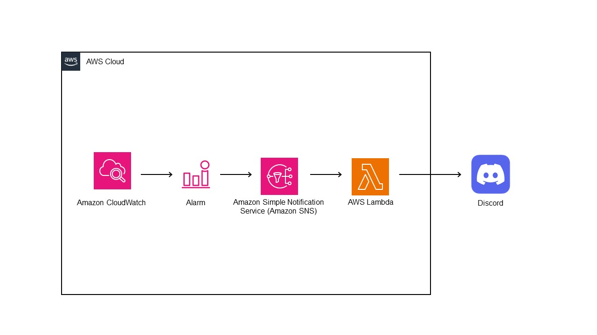

# AWS SNS Notification to Discord

A short project on how to get AWS SNS notifications in your Discord server and channel of your choosing.

This is made possible by using the Discord webhook and a couple of AWS services. As I utilise Discord quite predominantly everyday, I was inquisitive to see if it was possible to send Cloudwatch Alarm alerts to Discord. 

Albeit this project focuses on Cloudwatch Alarm alerts, it can definitely be adapted to other services that can utilise SNS topics (as long as you are aware of the message format). 

Below is a quick architecture diagram:

Access the [walkthrough](https://github.com/OTarique/SNS_Discord/blob/main/walkthrough.md) on how to set this up for your environment using Terraform. 