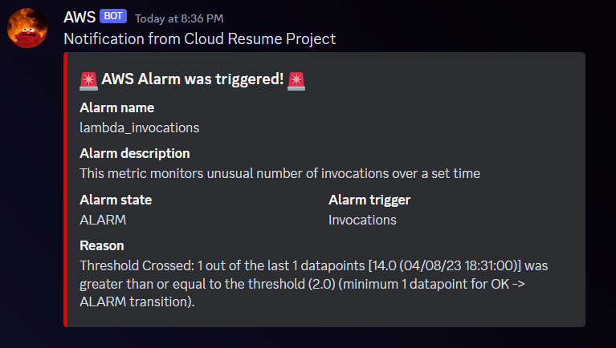

# Walkthrough - SNS Notifications to Discord for Cloudwatch Alarms using Terraform

This walkthrough will provide step-by-step instructions on how to setup SNS notifications to a Discord server and channel of your choosing. 

Please note that this focuses on sending Cloudwatch alarm notifications but can definitely be adapted to any other service that can utilise AWS SNS (as long as you are aware of the message format).

Below is a quick diagram of the architecture:


# Table of Contents

- [Walkthrough - SNS Notifications to Discord for Cloudwatch Alarms using Terraform](#walkthrough---sns-notifications-to-discord-for-cloudwatch-alarms-using-terraform)
- [Table of Contents](#table-of-contents)
  - [1. Discord webhook](#1-discord-webhook)
  - [2. Setting up your Terraform environment](#2-setting-up-your-terraform-environment)
    - [2.1 Providers template](#21-providers-template)
    - [2.2 Variables templates](#22-variables-templates)
  - [3. Main configurations and Lambda function](#3-main-configurations-and-lambda-function)
    - [3.1 SNS Topic](#31-sns-topic)
    - [3.2 Parameter Store](#32-parameter-store)
    - [3.3 IAM](#33-iam)
    - [3.4 Lambda function](#34-lambda-function)
    - [3.5 Package Lambda function](#35-package-lambda-function)
    - [3.6 Subscribe Lambda function to SNS Topic](#36-subscribe-lambda-function-to-sns-topic)
    - [3.7 Create Cloudwatch log group](#37-create-cloudwatch-log-group)
  - [4. Test your configuration](#4-test-your-configuration)
  - [5. References](#5-references)

## 1. Discord webhook

You can follow the steps listed on this [webpage](https://support.discord.com/hc/en-us/articles/228383668-Intro-to-Webhooks) to generate your webhook for the server and channel of your choosing.

Ensure you have copied the webhook URL after it gets generated.

## 2. Setting up your Terraform environment

### 2.1 Providers template

You can access the template file here: [providers.tf](https://github.com/OTarique/SNS_Discord/blob/main/providers.tf)

Please ensure you edit the following fields based on your AWS region and profile name as configured on your machine.

```ruby
provider "aws" {
  region = "{enter your region here}"
  profile = "{enter your profile here}"
}
```
### 2.2 Variables templates

Please edit the variable names and descriptions as you see fit in the [variables.tf](https://github.com/OTarique/SNS_Discord/blob/main/variables.tf) file.

Thereafter, edit the [terraform.tfvars](https://github.com/OTarique/SNS_Discord/blob/main/terraform.tfvars) with the actual values for the variables. Important that you paste the webhook url in the applicable variable as this will be needed later.

```ruby
discord_webhook = "{enter your webhook here}"
```
## 3. Main configurations and Lambda function

All the configurations needed in your AWS account is setup in the [main.tf](https://github.com/OTarique/SNS_Discord/blob/main/main.tf)

You can definitely split up each configuration into its own .tf file if you prefer.

Morever, I have named each resource variable as 'example'. Please change it to a variable name of your choosing. This also applies to the any 'name' variable in any resource.

### 3.1 SNS Topic

Set up your SNS topic.

```ruby
resource "aws_sns_topic" "example" {
  name = "SNS_Notifications_Discord" #rename this
  tags = var.common_tags
}
```
### 3.2 Parameter Store

To keep things secure, we will create a Parameter Store on AWS Systems Manager for our Discord Webhook. This will be retrived by our Lambda function on invocation.

```ruby
resource "aws_ssm_parameter" "example" {
  name        = "DiscordWebHook" #rename this
  description = "Discord webhook for alarms" #rename this
  type        = "SecureString"
  key_id      = "alias/aws/ssm"
  value       = var.discord_webhook

  tags = var.common_tags
}
```
### 3.3 IAM

We will need to create a role with permissions that allow the Lambda function to execute the necessary operations.

First we create a role with access to the Lambda.
```ruby
resource "aws_iam_role" "example" {
  name = "discord_role" #rename this

  assume_role_policy = jsonencode({
    Version = "2012-10-17"
    Statement = [
    {
      "Action": "sts:AssumeRole",
      "Principal": {
        "Service": "lambda.amazonaws.com"
      },
      "Effect": "Allow",
      "Sid": ""
    }
  ]
})
}
```
Next we create a set of permissions that will:
- Retrieve Discord webhook URL from Parameter Store
- Write to Cloudwatch logs

```ruby
data "aws_iam_policy_document" "example" {
  statement {
    sid = "ssm"
    effect = "Allow"
    actions = [ "ssm:Describe*",
                "ssm:Get*",
                "ssm:List*"]
    resources = [ "${aws_ssm_parameter.example.arn}" ]
  }

    statement {
    sid = "cloudwatch"
    effect = "Allow"
    actions = [ "logs:CreateLogStream","logs:PutLogEvents","logs:CreateLogStream","logs:CreateLogGroup"]
    resources = [ "arn:aws:logs:*:*:*"]
  }
}
```
Lastly, we will attach this policy to the role.

```ruby
resource "aws_iam_role_policy" "example" {
  name = "discord_role_permissions" #rename this
  role = aws_iam_role.example.id
  policy = data.aws_iam_policy_document.example.json
}
```
### 3.4 Lambda function

Now we need to create our [Lambda function](https://github.com/OTarique/SNS_Discord/blob/main/mySNSDiscordFunc.py). I am using Python in this walkthrough but you can adapt it to a language of your choosing.

We first start my importing and necessary libraries and initialising our client to access Parameter Store in AWS Systems Manager.


```ruby
import json
import os
import requests

#Create a SSM Client to access parameter store
import boto3 
ssm = boto3.client('ssm') 
```
Next we will define a function that will do the following:

- Grab the 'message' from the SNS event, which is in a JSON format.

```ruby
def lambda_handler(event,context):
    
    print(json.dumps(event))
    
    message = json.loads(event['Records'][0]['Sns']['Message'])
    print(json.dumps(message))
```

- From this 'message', we grab the relevant information we would like to pass to Discord. [Here](https://docs.aws.amazon.com/AWSCloudFormation/latest/UserGuide/aws-resource-cloudwatch-alarm.html) is list of information that can be pulled.

```ruby
    #Getting the variables from the JSON message
    alarm_name = message['AlarmName']
    new_state = message['NewStateValue']
    reason = message['NewStateReason']
    trigger = message['Trigger']['MetricName']
    description = message['AlarmDescription']
```

- Create a message variable that will be passed to Discord.
```ruby
    #Generate message to pass to Discord webhook
    discord_message =  [
        {
          "name": "Alarm name",
          "value": alarm_name,
        },
        {
          "name": "Alarm description",
          "value": description,
        },
        {
          "name": "Alarm state",
          "value": new_state,
          "inline" : True
        },
        {
          "name": "Alarm trigger",
          "value": trigger,
          "inline" : True
        },
        {
          "name": "Reason",
          "value": reason
        }]
```
- Create a variable that contains the structure of the webhook expected by Discord. You can view structure of the Discord webhook data [here](https://birdie0.github.io/discord-webhooks-guide/discord_webhook.html). Do check out all the content on there as it is a fantastic resource. It is packed with information. You can get creative and customise the message structure to you liking.


```ruby
    discord_webhook_data = {
        'username': 'AWS',
        'avatar_url': 'https://i.imgflip.com/29s5ao.jpg',
        "content": os.environ['project_name'],
        'embeds': [{
            'title': ":rotating_light: AWS Alarm was triggered! :rotating_light:",
            'color': 15204352,
            'fields': discord_message
        }]
    }
```

- Grab the Discord webhook URL from Parameter Store

```ruby
webhook_url = ssm.get_parameter(Name=os.environ['ssm_name'], WithDecryption=True)
```

- Finally, send a request to the Discord webhook url with the message.

```ruby
    headers = {'content-type': 'application/json'}
    response = requests.post(webhook_url['Parameter']['Value'], data=json.dumps(discord_webhook_data),
                                 headers=headers)

    print("Status Code", response.status_code)
    
    return(response.status_code)
```

### 3.5 Package Lambda function

Now we shift back to Terraform where we need to package the Lambda function and create it on AWS.

```ruby
#Lambda function setup
data "archive_file" "example" {
  type        = "zip"
  source_file = "mySNSDiscordFunc.py" #please rename this to your python file name
  output_path = "mySNSDiscordFunc.zip" #please rename this to your python file name
}

resource "aws_lambda_function" "example" {
  filename          = data.archive_file.example.output_path
  function_name     = "mySNSDiscordFunc" #rename this
  role              = aws_iam_role.example.arn
  source_code_hash  = data.archive_file.example.output_base64sha256
  handler           = "mySNSDiscordFunc.lambda_handler" #name of file.function name in py file
  runtime           = "python3.7"
  timeout           = "1"

  environment {
    variables = {
      ssm_name = "${aws_ssm_parameter.example.name}"
      project_name = "Notification from ${var.project_name}"
    }
  }

  tags = var.common_tags

}

#Adding trigger to lambda function so it executes when SNS is triggered
resource "aws_lambda_permission" "example" {
  statement_id  = "AllowExecutionFromSNS"
  action        = "lambda:InvokeFunction"
  function_name = aws_lambda_function.example.function_name
  principal     = "sns.amazonaws.com"

  source_arn = "${aws_sns_topic.example.arn}"
}
```

### 3.6 Subscribe Lambda function to SNS Topic

Here we will add a subscription to the Lambda.

```ruby
#Adding the lambda function as a subscription to the SNS Topic
resource "aws_sns_topic_subscription" "example" {
  topic_arn = aws_sns_topic.example.arn
  protocol  = "lambda"
  endpoint  = aws_lambda_function.example.arn
}
```

### 3.7 Create Cloudwatch log group

Create a Cloudwatch log group so you can keep track of invocations made against your lambda function.

NOTE: This does get created automatically by AWS but it's good practice to have this as part of your IaC template.

```ruby
#Adding a log group to cloudwatch for tracking.
resource "aws_cloudwatch_log_group" "example" {
  name = "/aws/lambda/${aws_lambda_function.example.function_name}"
  retention_in_days = 30 #change this to your liking
}
```
## 4. Test your configuration

After deploying all your resources, you should be able to test that it works as intended. You can acheive this by either creating a test case in AWS Lambda or purposefully manipulating your resource to trigger the SNS topic. 

Below is an example of what it looks like in Discord for an alarm created against the number of invocation for a lambda function. I set the threshold to a low value such that the alarm triggers after a small number of invocations.



## 5. References

Credit where credit is due.

- [Discord webhook guide](https://birdie0.github.io/discord-webhooks-guide/index.html)
- [Generating Slack Notifications from AWS CloudWatch Alarms](https://medium.com/analytics-vidhya/generate-slack-notifications-for-aws-cloudwatch-alarms-e46b68540133)
- [Cloudwatch Alarms with SNS Topic](https://github.com/DanielDaCosta/cloudwatch-alarms/tree/master)
- [AWS Cloudwatch Alarm](https://docs.aws.amazon.com/AWSCloudFormation/latest/UserGuide/aws-resource-cloudwatch-alarm.html)
- [Using Cloudwatch Alarms](https://docs.aws.amazon.com/AmazonCloudWatch/latest/monitoring/AlarmThatSendsEmail.html)
- [Parsing message formats](https://docs.aws.amazon.com/sns/latest/dg/sns-message-and-json-formats.html#http-notification-json)